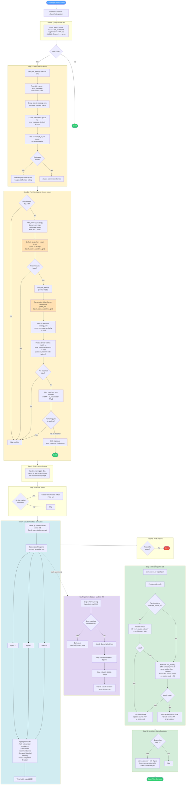

# Batch RCA Analysis Flow

```mermaid
flowchart TD
    Start([Cron trigger every 20 min]) --> LoadEnv[Load env vars from .claude/settings.json]

    LoadEnv --> Step1

    subgraph Step1["Step 1: Query Source DB"]
        Q[query_source_db.py<br/>SELECT job_id WHERE ai_processed = FALSE<br/>AND job_finished >= --since]
    end

    Step1 --> NoJobs{Jobs found?}
    NoJobs -- No --> Done([Exit 0])
    NoJobs -- Yes --> Step1a

    subgraph Step1a["Step 1a: Intra-Batch Dedup"]
        direction TB
        D1[pre_filter_jobs.py --dedup-only]
        D2[Fetch job_name + error_message<br/>from source table]
        D3[Group jobs by catalog_item<br/>extracted from job_name]
        D4[Cluster within each group by<br/>error_message similarity >= 0.75]
        D5[Pick earliest job_id per cluster<br/>as representative]
        D6{Duplicates<br/>found?}
        D7[Output representatives list<br/>+ dupes list for later linking]
        D8[All jobs are representatives]

        D1 --> D2 --> D3 --> D4 --> D5 --> D6
        D6 -- Yes --> D7
        D6 -- No --> D8
    end

    Step1a --> Step1b

    subgraph Step1b["Step 1b: Pre-Filter Against Known Issues"]
        direction TB
        F0{--no-pre-filter<br/>flag set?}
        F1[fetch_known_issues.py<br/>Query recent high-confidence results<br/>from last 4 hours]
        F1a["Exclude rows where result ticket<br/>closed >= 4h ago (ticket_resolve_datetime_gmt)"]
        F2{Known issues<br/>found?}
        F3["pre_filter_jobs.py<br/>(normal mode)"]
        F3a["Same active-ticket filter on results row<br/>(ticket_link, ticket_resolve_datetime_gmt)"]
        F4["Pass 1: Match on catalog_item<br/>+ error_message similarity >= 0.75"]
        F5["Pass 2: Cross-catalog match on<br/>error_message similarity >= 0.90<br/>(catches platform-wide failures)"]
        F6{Pre-matched<br/>jobs?}
        F7[store_report.py --pre-matched<br/>Set FK + ai_processed = TRUE]
        F8{Remaining jobs<br/>to analyze?}
        F9[Link dupes via<br/>store_report.py --link-dupes]
        F10[Skip pre-filter]

        F0 -- Yes --> F10
        F0 -- No --> F1 --> F1a --> F2
        F2 -- No --> F10
        F2 -- Yes --> F3 --> F3a --> F4 --> F5 --> F6
        F6 -- No --> F10
        F6 -- Yes --> F7 --> F8
        F8 -- No, all matched --> F9 --> Done2([Exit 0])
        F8 -- Yes --> F10
    end

    Step1b --> Step2

    subgraph Step2["Step 2: Build Claude Prompt"]
        P1[Inject remaining job IDs,<br/>batch_id, and known issues<br/>into orchestration prompt]
    end

    Step2 --> Step3

    subgraph Step3["Step 3: MLflow Setup"]
        M1{MLflow tracing<br/>enabled?}
        M2[Create venv + install mlflow<br/>if first run]
        M3[Skip]
        M1 -- Yes --> M2
        M1 -- No --> M3
    end

    Step3 --> Step4

    subgraph Step4["Step 4: Claude Headless Execution"]
        direction TB
        C1["claude -p --model claude-sonnet-4-6<br/>Sends orchestration prompt"]
        C1 --> SpawnAgents["Spawn parallel agents<br/>(one per remaining job)"]
        SpawnAgents --> A1["Agent 1"] & A2["Agent 2"] & A3["Agent N"]
        A1 & A2 & A3 --> AGG
        AGG["Aggregate results:<br/>- Tally categories + confidence<br/>- Deduplicate recommendations<br/>- Semantic historical matching<br/>- Cross-job pattern detection"]
        AGG --> WriteReport["Write batch report JSON"]
    end

    subgraph PerAgent["Each Agent: root-cause-analysis skill"]
        direction TB
        S1["Step 1: Parse job log<br/>(auto-fetch via SSH)"]
        S1check{Error matches<br/>known issue?}
        S1early["Early exit:<br/>matched_known_issue"]
        S2["Step 2: Query Splunk logs"]
        S3["Step 3: Correlate AAP + Splunk"]
        S4["Step 4: Fetch GitHub configs"]
        S5["Step 5: Claude analysis<br/>+ generate summary"]
        S1 --> S1check
        S1check -- Yes --> S1early
        S1check -- No --> S2 --> S3 --> S4 --> S5
    end

    SpawnAgents -.->|each agent runs| PerAgent

    Step4 --> Step4b

    subgraph Step4b["Step 4b: Verify Report"]
        V1{Report file<br/>exists?}
        V1 -- No --> Fail([Exit 1])
    end

    Step4b --> Step5

    subgraph Step5["Step 5: Store Report in DB"]
        direction TB
        ST1[store_report.py report.json]
        ST2["For each job result:"]
        ST3{Agent declared<br/>matched_result_id?}
        ST4["Validate match:<br/>id + root_cause_category<br/>+ confidence = high"]
        ST5{Valid?}
        ST6["Use matched FK<br/>Update source: FK + ai_processed"]
        ST7["Fallback: find_match()<br/>difflib similarity >= 0.85<br/>same catalog_item + category<br/>+ excludes closed tickets on results row (>=4h)"]
        ST8{Match found?}
        ST9["INSERT into results table<br/>Update source: FK + ai_processed"]

        ST1 --> ST2 --> ST3
        ST3 -- Yes --> ST4 --> ST5
        ST5 -- Yes --> ST6
        ST5 -- No --> ST7
        ST3 -- No --> ST7
        ST7 --> ST8
        ST8 -- Yes --> ST6
        ST8 -- No --> ST9
    end

    Step5 --> Step5b

    subgraph Step5b["Step 5b: Link Intra-Batch Duplicates"]
        direction TB
        L1{Dupes from<br/>Step 1a?}
        L2["store_report.py --link-dupes<br/>Copy representative's FK<br/>to each duplicate job"]
        L3[Skip]
        L1 -- Yes --> L2
        L1 -- No --> L3
    end

    Step5b --> Success([Batch RCA Complete])

    style Start fill:#4a9eff,color:#fff
    style Done fill:#2ecc71,color:#fff
    style Done2 fill:#2ecc71,color:#fff
    style Success fill:#2ecc71,color:#fff
    style Fail fill:#e74c3c,color:#fff
    style Step1a fill:#fff3cd
    style Step1b fill:#fff3cd
    style Step4 fill:#d1ecf1
    style PerAgent fill:#e2d6f3
    style Step5 fill:#d4edda
    style Step5b fill:#d4edda
    style F1a fill:#ffe0b2
    style F3a fill:#ffe0b2
```
