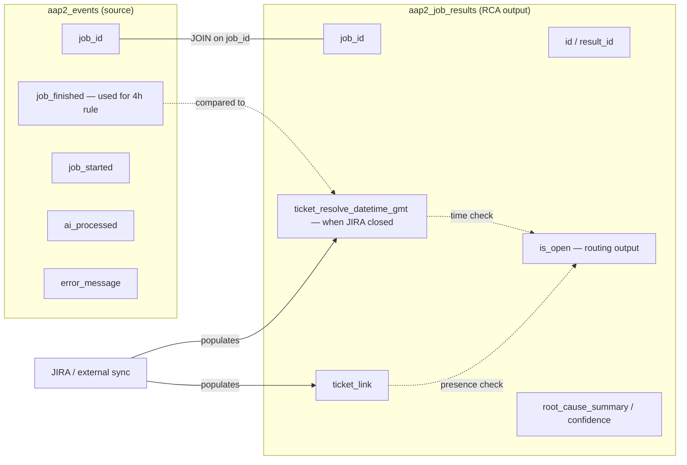
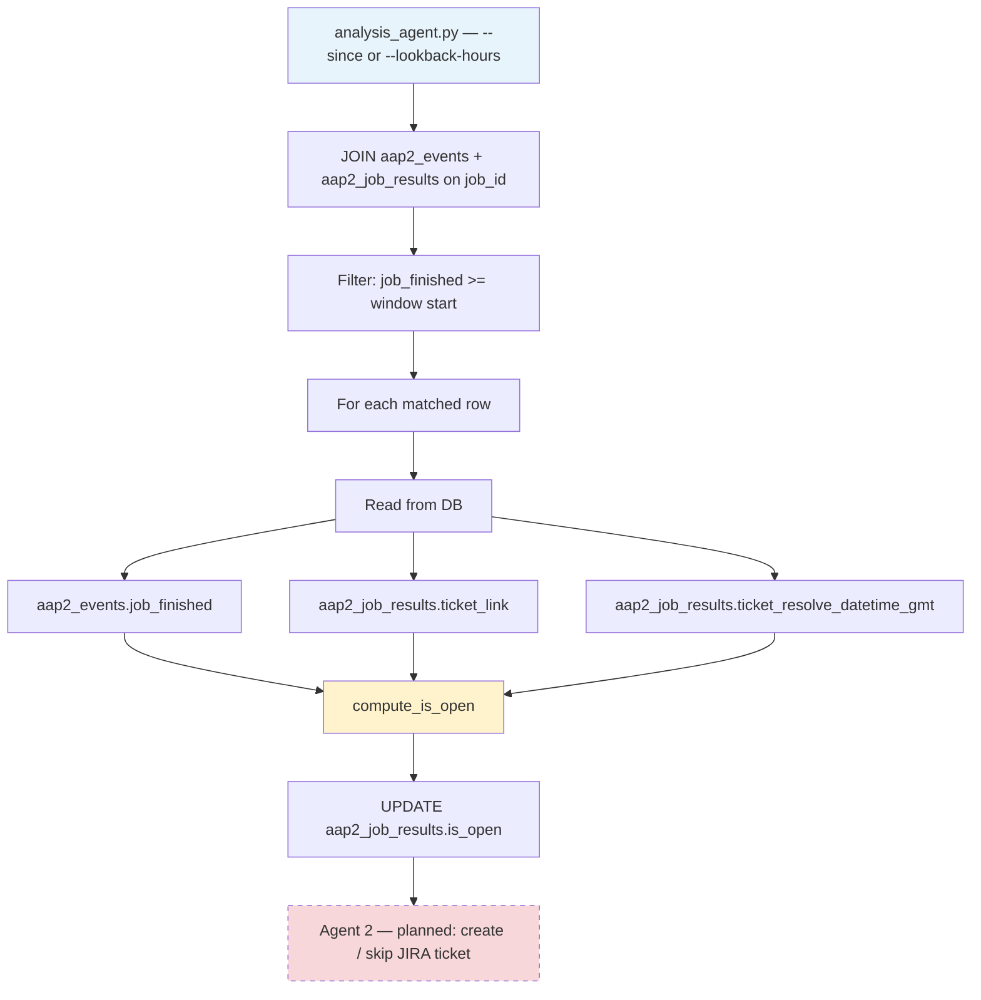
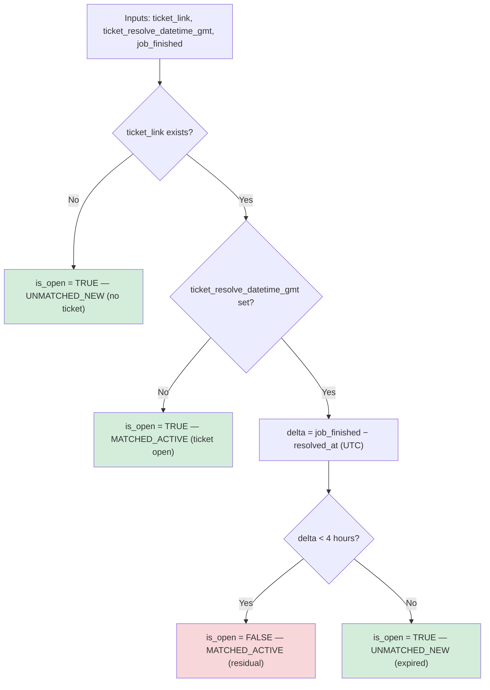
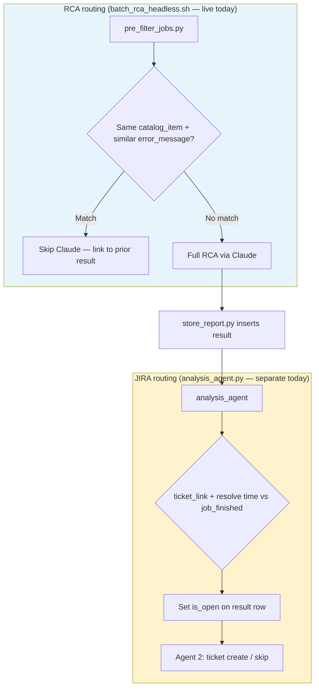

# JIRA Ticket Routing & Data Model

How `analysis_agent.py` routes tickets using `aap2_events` and `aap2_job_results`, and where each field lives.

## Where the data lives



| Table | Key columns | Role |
|-------|-------------|------|
| `aap2_events` | `job_id`, `job_finished`, `job_started`, `error_message`, `ai_processed` | Source failures from AAP; `job_finished` anchors the 4-hour rule |
| `aap2_job_results` | `id`, `job_id`, `ticket_link`, `ticket_resolve_datetime_gmt`, `is_open`, RCA fields | RCA output + JIRA state; `is_open` is written by `analysis_agent.py` |

Env vars (from `.claude/settings.json` or shell): `SOURCE_DB_TABLE`, `SOURCE_DB_RESULT_TABLE`.

**Writers today**

| Field | Populated by |
|-------|----------------|
| `aap2_events.*` | AAP ETL pipeline |
| RCA fields on results | `store_report.py` after Claude batch |
| `ticket_link` | External JIRA integration or manual test data |
| `ticket_resolve_datetime_gmt` | External JIRA sync (UTC/GMT wall time) |
| `is_open` | `analysis_agent.py` (`compute_is_open`) |

`ticket_resolve_datetime_gmt` should be stored as naive UTC/GMT (e.g. `2026-08-17 12:00:00`), not local time with offset, unless the column is `timestamptz` and the instant is correct in UTC.

---

## JIRA routing gate (Agent 1)

`analysis_agent.py` joins both tables, compares ticket state to `job_finished`, and updates `is_open`. Agent 2 (planned) will read `is_open` to create, re-open, or skip JIRA tickets.



**Note:** This script is not wired into `batch_rca_headless.sh` yet; run it manually or add it as a cron step before ticket creation.

---

## Routing decision (`compute_is_open`)

Ansible jobs can run up to ~4 hours. If a ticket was resolved recently and the job still failed, the failure is likely **residual** (the job started before the fix landed).



| Condition | `is_open` | Label | Ticket action (Agent 2) |
|-----------|-----------|-------|---------------------------|
| No `ticket_link` | `true` | UNMATCHED_NEW (no ticket) | Create new ticket |
| `ticket_link`, no resolve time | `true` | MATCHED_ACTIVE (ticket open) | Ticket still open |
| Resolved &lt; 4h before `job_finished` | `false` | MATCHED_ACTIVE (residual) | Skip — residual failure |
| Resolved ≥ 4h before `job_finished` | `true` | UNMATCHED_NEW (expired) | New incident — re-open or new ticket |

`ticket_link` is only checked for presence (any non-empty string). The URL is not fetched or validated.

---

## RCA routing vs JIRA routing

These are separate layers; do not conflate them in operations or demos.



| Layer | Script | Question it answers |
|-------|--------|-------------------|
| RCA pre-filter | `pre_filter_jobs.py` | Have we already analyzed this failure pattern? |
| JIRA gate | `analysis_agent.py` | Should we open a JIRA ticket for this result? |

---

## Run the routing gate

```bash
# Load env from repo settings, then run (from scripts/)
eval "$(python3 -c "
import json
with open('/path/to/.claude/settings.json') as f:
    for k, v in json.load(f).get('env', {}).items():
        print(f'export {k}={json.dumps(v)}')
")"

cd deploy/batch-rca-automation/scripts
python3 analysis_agent.py --lookback-hours 24
# or: python3 analysis_agent.py --since '2026-08-17T00:00:00'
```

Tests (no DB): `pytest deploy/batch-rca-automation/tests/test_analysis_agent.py`
